# Locality Sensitive Hashing

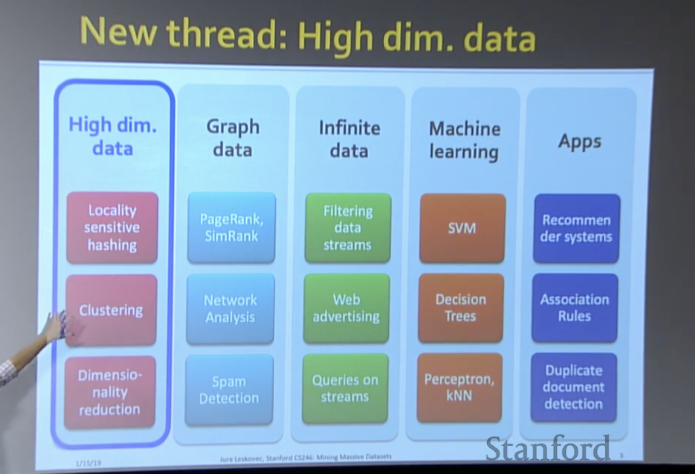</img>

LHS could be the basis for the recommendation system.

e.g. Image search

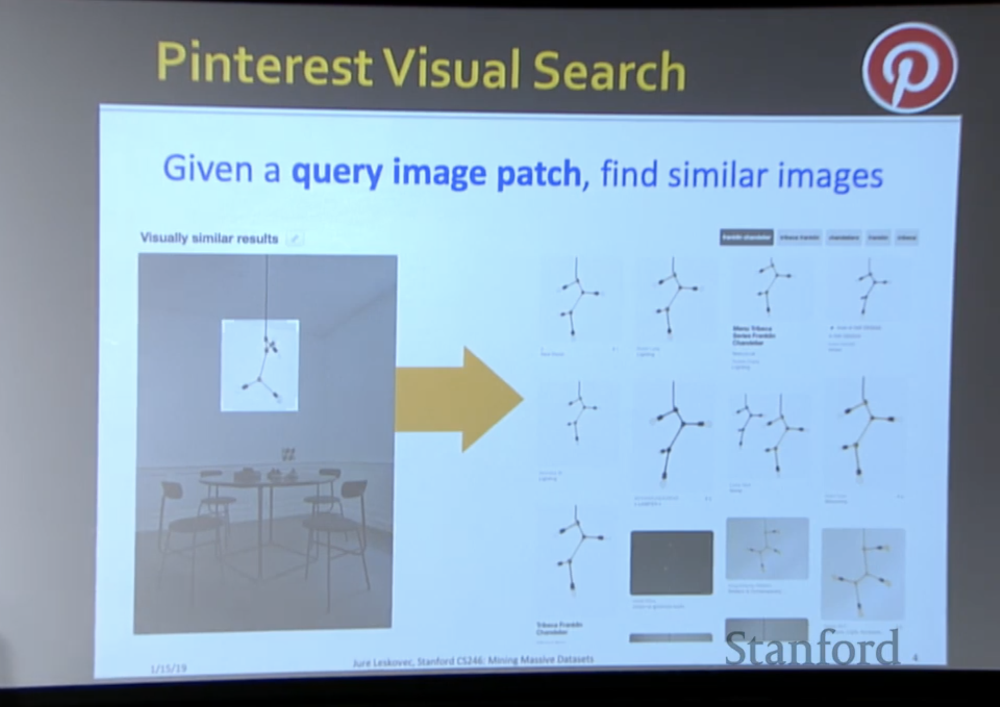</img>

Pintrest : 4B images

user eanna search the similar images of query.

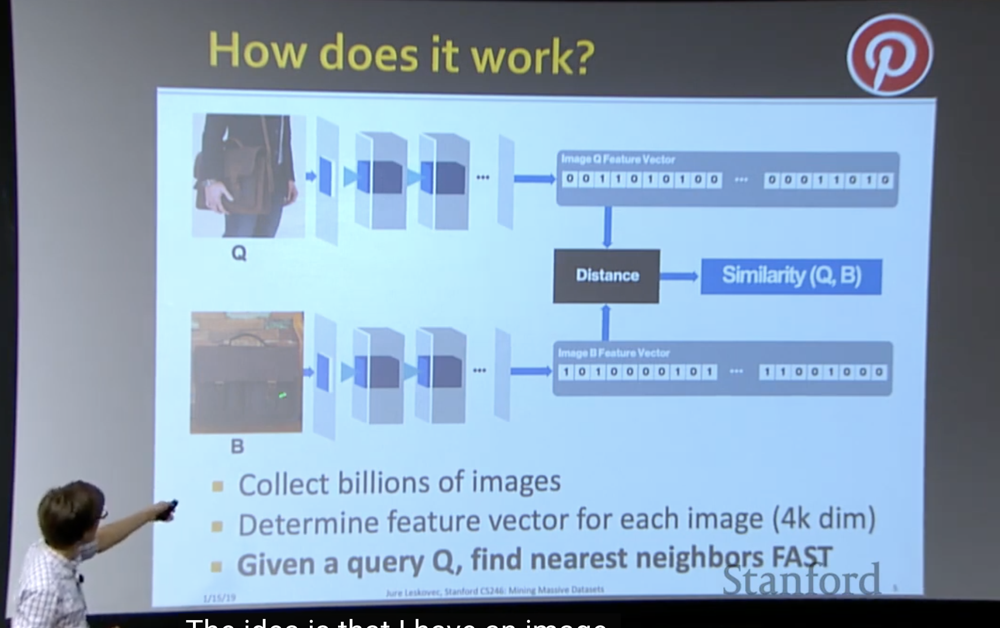</img>

Collect billions of images

determine the feature representation of each image.

Given a query Q, find nearest neighbors FAST.

Other Applications

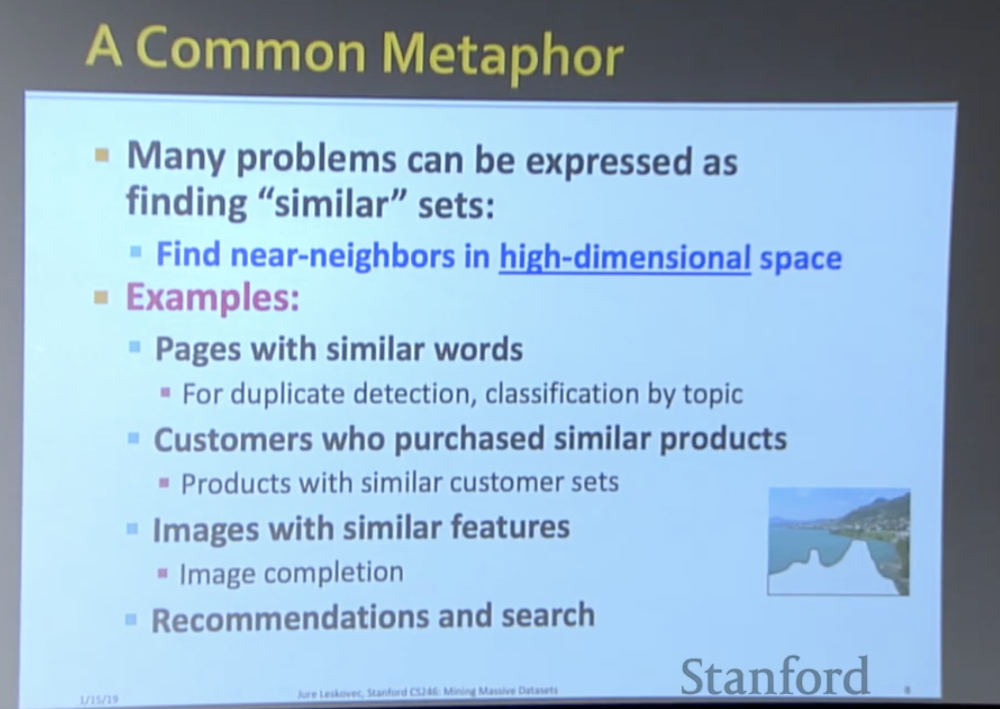</img>

1. Google - Pages with simiar words
2. Shopee - similar products
3. Pintrest - similar pictures
4. ...

# Problem for todat's lecture

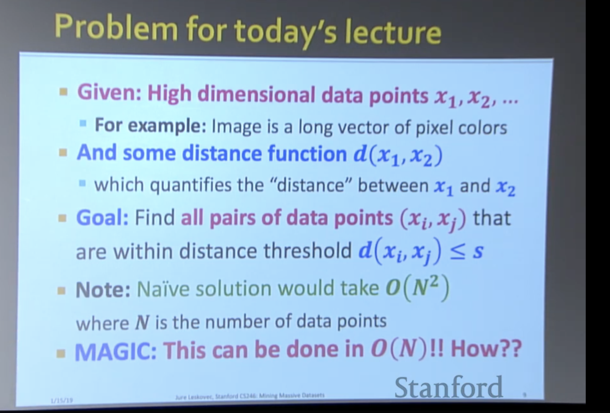</img>

1. LSH is really a family of related techniques.
2. In general, one throws items into buckets using serveral different **hash functions**

examine - 檢查
upside - 優勢
downside - 劣勢

3. You only examine only those pairs of itmes that share a bucket for at lease one of these hasgings.(we don't need to check all of he itmes, you know it right?)
   1. (Upside) If you design the hash function correctly, only a small fraction of pairs are ever examined.
   2. (DOwnside) There are false negtives - pairs of similar items that never even got considered.

# Naive approach

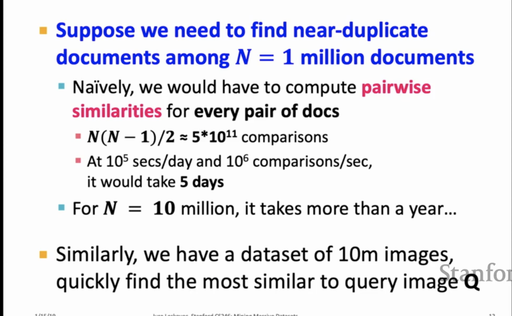</img>

# LSH

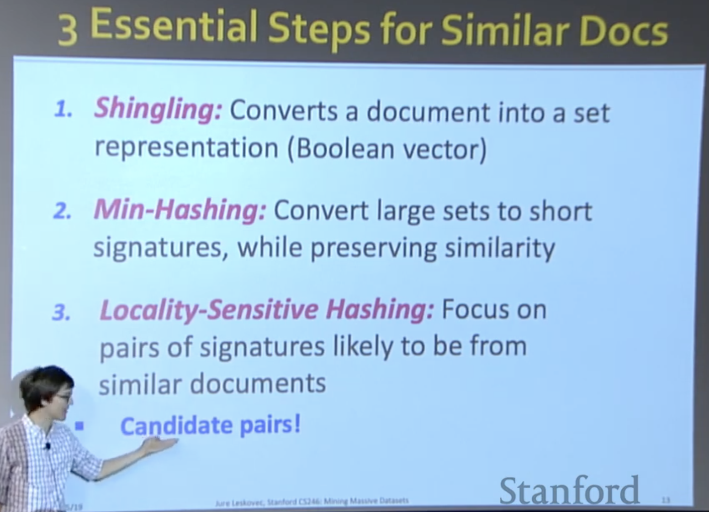</img>

# Shingling

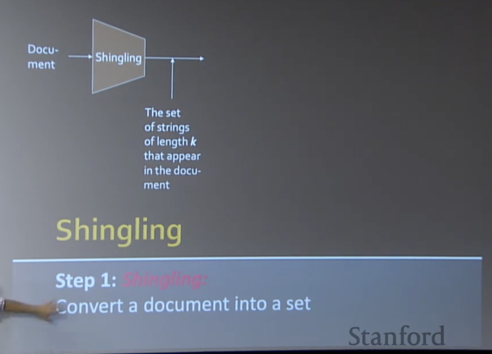</img>

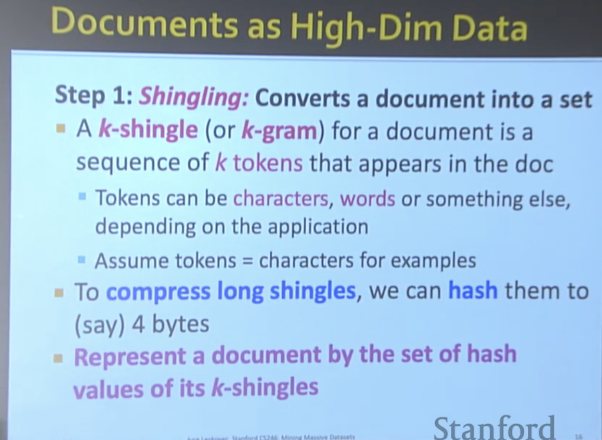</img>

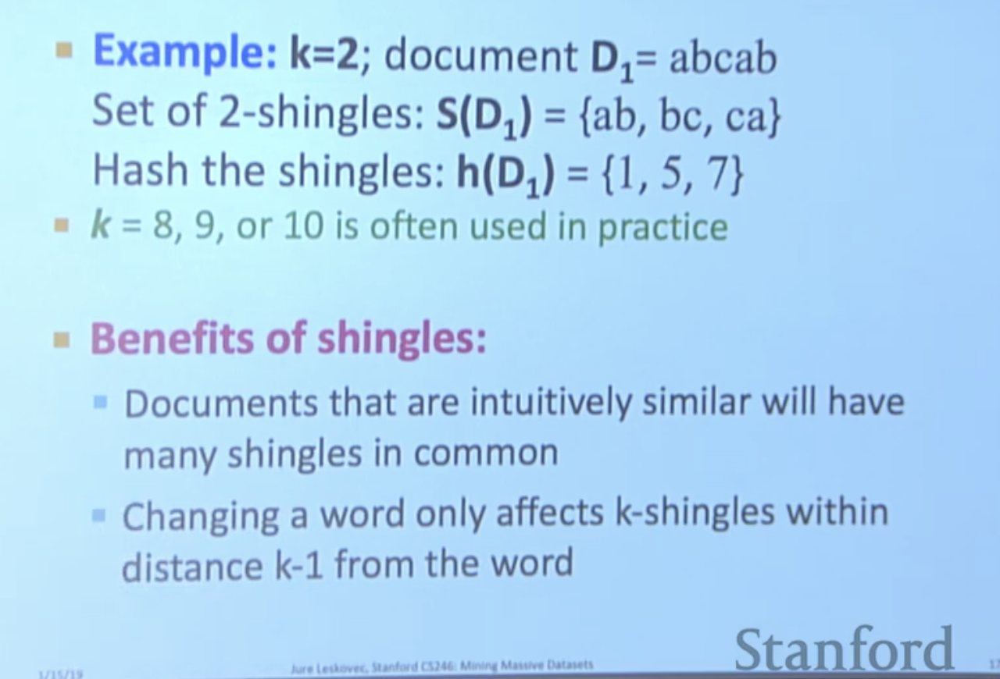</img>

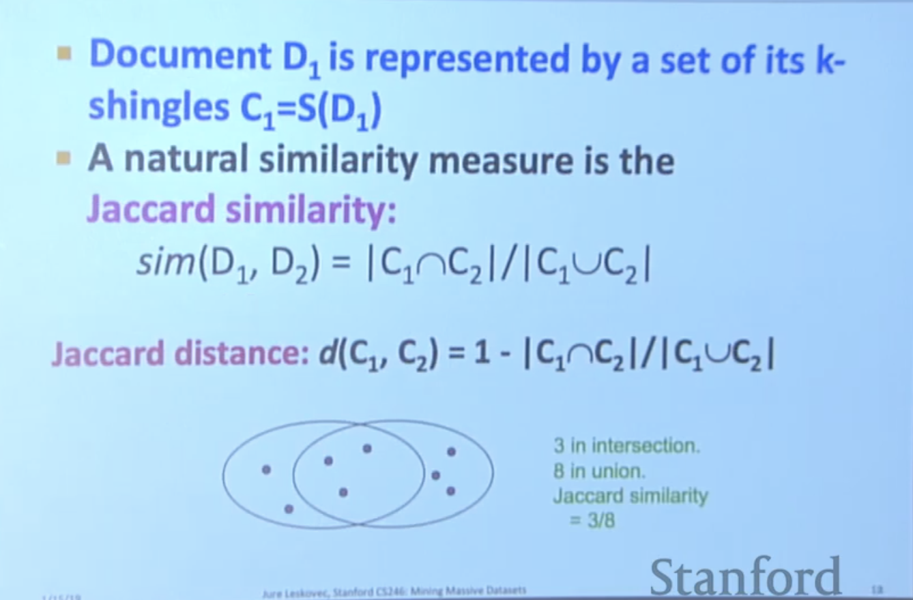</img>

Jaccard similiarity --> Interection over Union(same as detection task)

similarity basically means the same as distances.

## From Sets to Boolean Matrices

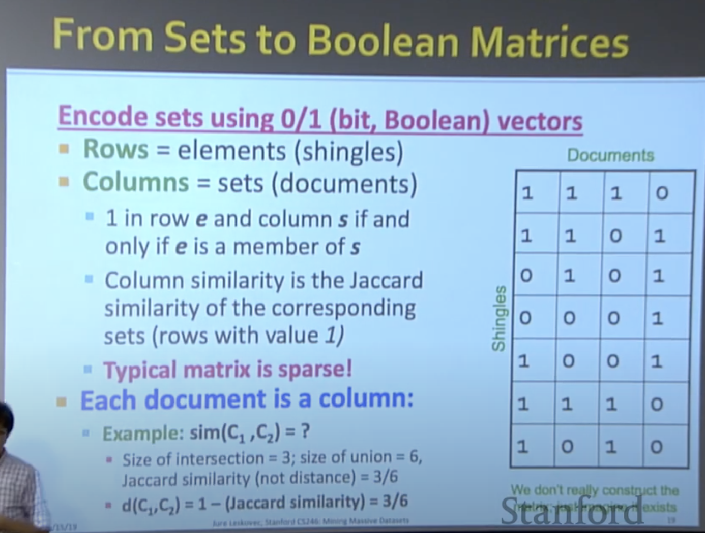</img>

TODO : https://www.youtube.com/watch?v=dRWO3il-jjA&list=PLoCMsyE1cvdVnCgHk43vRy7PVTVWJ6WVR&index=3

20:21