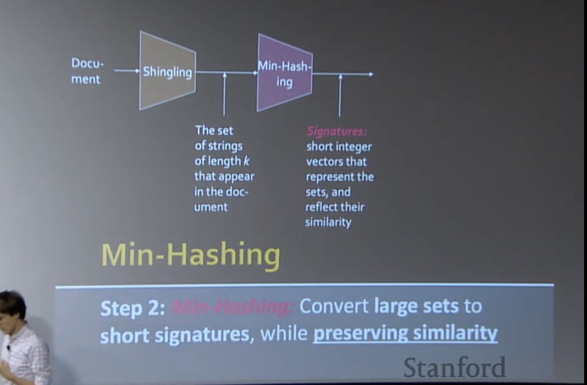

# Locality Sensitive Hashing

</img>

LHS could be the basis for the recommendation system.

e.g. Image search

</img>

Pintrest : 4B images

user eanna search the similar images of query.

</img>

Collect billions of images

determine the feature representation of each image.

Given a query Q, find nearest neighbors FAST.

Other Applications

</img>

1. Google - Pages with simiar words
2. Shopee - similar products
3. Pintrest - similar pictures
4. ...

# Problem for today's lecture

</img>

1. LSH is really a family of related techniques.
2. In general, one throws items into buckets using serveral different **hash functions**

examine - 檢查
upside - 優勢
downside - 劣勢

3. You only examine only those pairs of itmes that share a bucket for at lease one of these hasgings.(we don't need to check all of he itmes, you know it right?)
   1. (Upside) If you design the hash function correctly, only a small fraction of pairs are ever examined.
   2. (DOwnside) There are false negtives - pairs of similar items that never even got considered.

# Naive approach

</img>

# LSH

</img>

# Shingling

Convert document into a set.

</img>

</img>

</img>

</img>

Jaccard similiarity --> Interection over Union(same as detection task)

similarity basically means the same as distances.

## From Sets to Boolean Matrices

</img>

actually a document(column), shilingling sparse matrix.

Q : how to tune/determine the k-shilingling
    * A1 : words are not random, your k should be small them the words(?)

When you build such a matrix. you can calculate the jaccard similarity between each column, it's fine.

</img>

notice the warning, these methods can produce flase negtive, even false positive.

</img>

# Min-Hashing

</img>

Convert Large sets to short signatures, while perserving similarity.

</img>

</img>

If sim($C_{1}$, $C_{2}$) is high, then with high prob $h(C_{1})$ = $h(C_{C2})$

If sim($C_{1}$, $C_{2}$) is low, then with high prob $h(C_{1})$ != $h({C_{2}})$

</img>

Interesting thing : we need a custom collision to match our algorithm!

</img>

Jaccard similarity <---> Min-Hashing

the hash function depedends on your similarity function!.

We'll talk more about the hashing function for cosine / euclidean distance.

</img>

## example

</img>

</img>

create a permutation $\pi$(just a shulffing)

</img>

we wanna create a signature matrix $M$

</img>

we look at our permutation column matrix.

we look at the value $1$, it's match the 2nd, 4th document. So the Signature matrix $M$ values become $1$

Same idea, we got value $2$ for document 1 and document 3.

Then we build another permutation, do the same thing!

you will get $[2,1, 4, 1]$ for signature matrix.

</img>

So that we can build a sigmature matrix $M$ for rows x columns = number of permutation(hash functions) x number of documentation.

## Why the similarity preserve? - The Min-Hash Poperty.
### One way to look this
Choose a random permutation $\pi$

Claim $Pr[h_{\pi}(C_{1}) = h_{\pi}C(_{2})] = sim(C_{1}, C_{2})$

Why?

**Let** $X$ be a doc(set of shingles), $z \in X$ is a shingle.

**Then** $Pr[\pi(z)] = min(\pi(X))] = \frac{1}{|X|}$

the prob that particular shingle is the first shingle = $\frac{1}{X}$, because our permutation is random basically.

</img>

### Here is another way

</img>

Consider another way, there is four type of comparison.

$a$ = # rows of type A

$b$ = # rows of type B

$c$ =  # rows of type C

$d$ =  # rows of type D

Jaccard similarity $sim(C_1, C_2) = \frac{a}{a+b+c}$

Claim :  $Pr[h(C_{1}) = h(C_{2})] = sim(C_1, C_2)$

If you look up the two docuemnt column(shingle), both of them is equal to 1. it's a type A-row.

so the # of type A = hit 1, 1

and the # of type B, C = hit 0, 1 or hit 1, 0

and the # of type D won't be considered 

</img>

</img>
## Similarity for Signatures

We know 

$Pr[h(C_{1}) = h(C_{2})] = sim(C_1, C_2)$

Now generalize to multiple hash functions.

Recall the signature matrix $M$

</img>

And we can expected : longer the sifnatures, the smaller the error will be.

</img>

Now we consider Smignature Matrix $M$ for sigature = 3, document = 4

</img>

consider Jaccard sim

c1 vs c3 = $\frac{3}{4}$ (Intersetion over Union)

sig_1 vs sig 3 = $\frac{2}{3}$  - they share $2$, $1$

In this case, we perserve the similarity order by transform the Shingles into signature.

# Implementation Trick

</img>

prohibitive - adj 禁止的

algo : 

</img>

Do the homework =)

Q : what's the difference between characters versus words?

A : it depends on your goal.

if your goal is to find documents that have mispelled words, predict the mis-spwllinf words - then do it at the character level.

if you wanna compare the document similarity, then shilingling at word level(or even paragraph level)

# Locality Sensitive Hashing

</img>

We have signaturee matrix. Now we need to find paire in signature matrix.

</img>

cadidate pair : because there might be false positve and false negtive.

we will use another set of hash function. hash signature matrix $M$ to many buckets.

Each pair of documents that hashes into the same bucket is a candidate pair.

</img>

$M(i, x) = M(i, y)$ for at least frac means jaccard similarity of documents of $x$ and $y$

e.g.

$x = 1, y = 3$, $sim = \frac{2}{3}$

</img>

</img>

make $k$ as large as possible, because we wanna have collisions when documents are similar.

</img>

## Assumption

same buket menas identical in that band(well, basically, they are just similar, not the same)

</img>

## Example Assume ($C_1$, $C_2$ are 80% Simmilar)

</img>

Start with Signatures Matrix $M$ with 100k docs and 100 integers(100 hash functions)

pick bands $b=20$, rows per band $r=5$

</img>

</img>

same bucket -> they are similar,

the probability $C_1$ and $C_2$ share same hash values == their similarity. which is 0.8

Now, a band with 5 rows means we need to match 5 rows. 

Means the prabability hashing $C_1, C_2$ into same bucket is $(0.8)^{5} = 0.328$

Now, what's the probability $C_1, C_2$ are not similar in all of the 20 bands?

$(1 - 0.328)^{20} = 0.00035$

means 

1. we might miss the cadidate pair(80% similar pair) with $\frac{1}{3000}$, they are **false negtive**

2. we would find **99.965% pairs of truly similar documents**(basically all of them...)

## Example Assume ($C_1$, $C_2$ are 30% Simmilar)

</img>

think about the other side,

$sim(C_1, C_2) < s$, we want $C_1, C_2$ to hash to No common buckets.(all bands should be different.)

1. prob of $C_1, C_2$ in one particular band : $(0.3)^{5} = 0.00243$

2. prob $C_1, C_2$ are not similar in all of the 20 bands : $(1 - 0.00243) ^{20} = 0.952$

3. prob $C_1, C_2$ identical in at least 1 of 20 bands : $1 - 0.953 = 0.0474$

Means : approximately $0.0474$ pairs of docs with similarity 0.3 end up becoming candidate pairs (**false positive**)

## LSH Involves a Tradeoff

</img>

tuning different $b$ and $r$, we get different flase positive and false negtives.

rows per band $r = 5$, bands $b=20$ -> rows per band$r=10$, bands $b=10$ fp go down, fn go up.

## The Analysis of LSH - What We Want

</img>

</img>

</img>

If 1 bnads of 1 rows. we have the min hashing properties. we start from a straight line.

And we wanna achieve our goal like the step function.

</img>

If we pick a threshold $s$

</img>

$b$ bands, $r$ rows/band

1. col $C_1$, $C_2$ have similarity $t$
2. pick any band $r$ rows
   1. prob : all rows in band equal = $t^{r}$
   2. prob : some row in band unequal = $1 - t^{r}$
3. prob : no band identical = $(1 - t^{r})^{b}$
4. prob : at least 1 band identical = $1 - (1 - t^{r})^{b}$ - prob of sharing the buckets.

well, the b bands fo r rows will give one a step function.

</img>

</img>

</img>

The more hash func we take, the more shaper the cure will be.

Q : In a normal situation, which one is more important?

A : reduce false negtive is first priority, because after one pass, we lose them forever(they are candidate), and we can filter false positve easily.

So, in this case, $s = 0.6$ might not be good, but it will be good with $s=0.8$

Q : Can we make our input with dense vector or something else?

A : Yes, they $r$ anf $b$ will stay the same, but the hash function will change respect to your similarity function. So, we're able to handle dense vector, binary vector, what ever you like, with different hash func.

# Summary

1. Shingling : Convert documents to set representation.
2. Min-Hsdhing - Convert larget sets to short signatures, while preserving similarity.
3. Locality-Sensitive Hadhing : Focus on pairs of signatures likely to be from similar documents.

# Stats

1 hour - 20mins

1 hour - 20 mins

25 mins - 5 mins

40 mins - 15 mins

1 hour - 15 mins