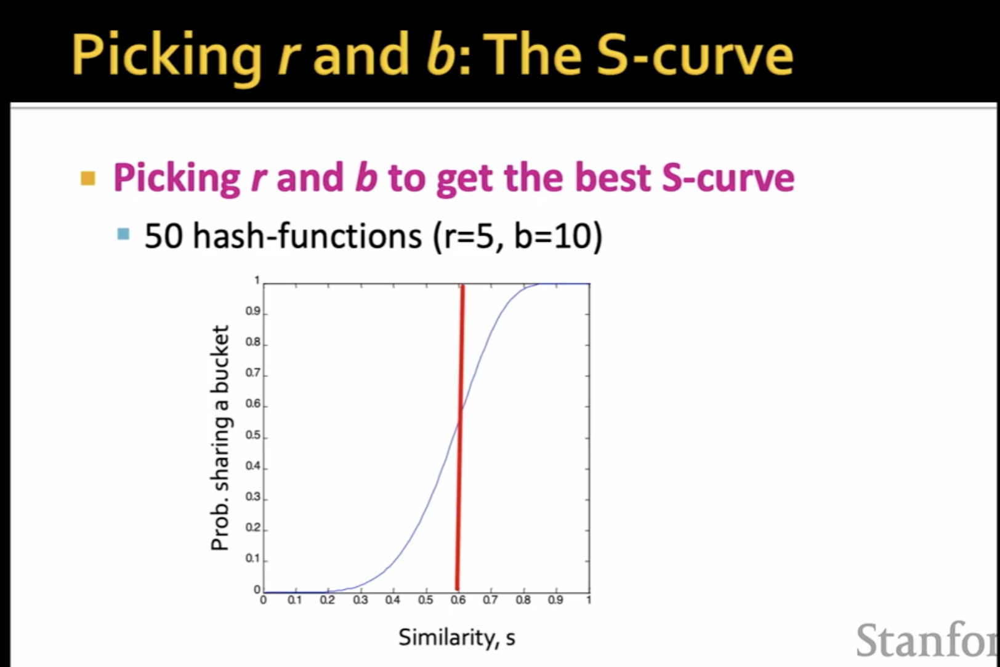

# L4

</img>

more hashing function, more accurate approx.

</img>

X axis - similarity cut of the signature matrix.

Y axis - prob of sharing >=1 buckets

The figure is ideal situation.

The fp and fn discussion.

In general, we wanna reduce fn, becuase if fp is high, we can do filter after LSH procudure. but we cannot save fn if they just be discards.

</img>

</img>

# How Do We Make the S-curve?

</img>

1. prob : element in a single row of $C_1, C_2$ are equal $=s$
2. prob : all rows in a band are equal $=s^{r}$
3. prob : some row in a band is not equal $=1-s^{r}$
4. prob : all bands are not equal $(1-s^{r})^{b}$
5. prob at least 1 band is equal = $1 - (1-s^{r})^{b}$ - $C_1, C_2$ Prob thatis a candidate pair

## Some example result

$k=50, s=0.6, r=5, b=10$

</img>

we can easily move our s to .8, .9 to reduce the fp, but we will increase fn.

# Stats

0.5 hour - 20mins

