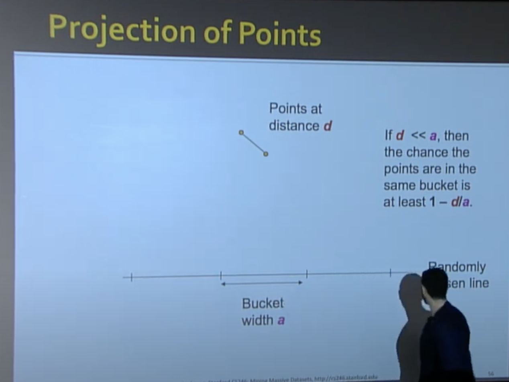

# L4

</img>

more hashing function, more accurate approx.

</img>

X axis - similarity cut of the signature matrix.

Y axis - prob of sharing >=1 buckets

The figure is ideal situation.

The fp and fn discussion.

In general, we wanna reduce fn, becuase if fp is high, we can do filter after LSH procudure. but we cannot save fn if they just be discards.

</img>

</img>

# How Do We Make the S-curve?

</img>

1. prob : element in a single row of $C_1, C_2$ are equal $=s$
2. prob : all rows in a band are equal $=s^{r}$
3. prob : some row in a band is not equal $=1-s^{r}$
4. prob : all bands are not equal $(1-s^{r})^{b}$
5. prob at least 1 band is equal = $1 - (1-s^{r})^{b}$ - $C_1, C_2$ Prob thatis a candidate pair

## Some example result

$k=50, s=0.6, r=5, b=10$

</img>

we can easily move our s to .8, .9 to reduce the fp, but we will increase fn.

$k=50, s=0.6$, change $r, b$

</img>

band = 1, rows per band = 1, basically hash once., we got straight line.

1. increase $r$, prob : sharing bucket are become harder.

2. $r=1$, increase $b$ : increase thr peob they sharing the bucket (because we hash them multiple times)

3. the 2 figure on the right hand : when we increse $r$
the curve shifting to 10.
(the more roes per band, the prob they sharing bucket is more strict.)
 
 
# Theory of LSH

</img>

</img>

Any func match following is distance measure

1. $d(x, y) \geq 0$
2. $d(x, y) = 0 ~ if ~ x=y$
3. $d(x, y) = d(y, x)$
4. $d(x, y) \neq d(x, z) + d(z, y)$ - triangle inequality.

1. jacarrd dist for set = 1 - jaccard similarity
2. cosine distance for vectors = angle between the vec
3. L2, L1, 

</img>

1. hash fun : is any func that allows us to say whether two element are equal.

2. $h(x) = h(y)$ : h says $x$ and $y$ are equal.

3. A family of hash fun is any set of hash funcs fromwhich we can pick one at random efficiently

</img>

</img>

So we want our function match the property, and looks like the curve above.

And how do you think the middle part of function should be?

**ideally, our threshold will lie between $d_{1}, d_{2}$, of course, we want the value above the threshold, prob grows rapidly, on the other hand, prob  decrease**

</img>

## Example of LS Family : MIn-Hash

$S=$ space of all sets,

$d=$ Jaccard distance ($1-d$ means similarity).

$H$ is family of Min-Hash functions for all permutations of rows.

Then for any hash function 
$h \in H$:

$$
Pr[h(x) = h(y)] = 1 - d(x, y)
$$

</img>

</img>

first thing we will talking about is why the bands techniqque works.

If we apply the LS Family into row in bands $r$,

Here is a Theorem

* Given family $H$, contruct faimly $H'$ consisting of $r$ functions from $H$

* For $h = [h_1, ... h_{r}]$ in $H'$ 
  * we say $h(x) = h(y)$ if and only if $h_{i}(x) = h_{i}(y)$ for all $i$

* if $H$ is $(d_1, d_2 , p_1, p_2)$ - sensitive

* then $H'$ is $(d_1, d_2, (p_{1}^{r}, p_{2}^{r})$ - sensitive.

* Proof : Use the fact that $h_{i}$ are indenpendent.

And this is the tradoff comes from.

we are lowers prob for large distances(Good) $p_{2}^{r}$,

but we also lowers probability for small distance(bad) $p_{1}^{r}$

</img>

</img>

In general, random hash function will be indenpendent, but there are small amount of them are correlated.(which is worse case.)

</img>

</img>

</img>

</img>

</img>

</img>

</img>

# How do we choose $r$ and $b$

</img>

</img>

pick $s=0.6$, we can change the behavior dramatically.

</img>

the bands(OR) and rows per band(AND), you can chain them serveral times to achieve your desired performance. - if you use api, it depends on your implementation in api.

# Summary

</img>

# LSH for other distance metrics.

</img>

</img>

</img>

</img>

## Random Hyperplanes for cosine similarity.

</img>

well, what's the random hyperplain telling us?

Consider the vector is a point in high dimensional space.

well, the positive means the point is lying above the random hyperplain, negtive means the point is lying below the random hyperplain.

[wiki](https://zh.wikipedia.org/wiki/%E5%B9%B3%E9%9D%A2_(%E6%95%B0%E5%AD%A6))

## Proof of Claim

</img>

</img>

The vector $v$ might be anywhere,

we do actually don't care about the location where $v$ stays.

Case above shows, $x$ and $y$ both above on the hyperplain.

</img>

Another case shows $x$ anf $y$ stays different location of the hyperplain.

So, we will build a lot of hyperplain. 

</img>

we have 

point, $x, y$,

hyperplain, red-dashline, blue-dashline

hyperplain normal vector, red-vector, blue-vector

So, red and blue hash fun(hyperplain) hash $x, y$ to different result.

red : different location

blue : same location.

ok, why prob of hash them into the same location is perportional to angle?(blue case)

and we can get the 

$prob[blue] = 1-\frac{\theta}{\pi}$

$prob[red] = \frac{\theta}{\pi}$

**Intution : the small angle between $x, y$, the less likelihood that there would be another plain cutting between theose into two locations., the less hash function return -1**

Q : how we sample our hyperplain hash function?

Q : how expensive it is to generate random vectors od different norm and with real values?

A : 

</img>

the result of hashing cosine distance by random hyperplain will be +1, -1

we don't need to generate random real values.

# LSH for Euclidean Distance

</img>

## projection on the line

</img>

lucky ase : 

Points thar are close hash in the same buckets

distant point end up in different buckets.

</img>

unlucky case : 

Top : unlucky quantiation

Bottom : unlucky projetion

How to make unlucky leee possibie to happend?

We use a lot of projections.

## Multiple Projections

</img>

## Analysis of points distance $d$ and bucket width $a$

</img>

if $d << a$, the points they are hashed into same bucket is $(1 - \frac{d}{a}) \rightarrow 1$

</img>

if $d >> a$, must be close to 90 degree for there to be any chance points go to the same bucket.

## LS-Family for Euclidean Distance

</img>

# Summary

</img>

</img>

QA

Q : What if we have a outlier in Euclidean Space? 

A : It will effect your model, you need to take out the outlier first. or you will can that it is in its own bucket.

Q : how do we overcome the curse of dimensinality without LSH?

A : LSH is not the tech to address the problem, you need to find another way.

</img>

 # Stats
 

0.5 hour - 20mins

0.75 hour - 15 mins

1 hour - 10 mins

1 hour - 15 mins

1 hour - 15 mins